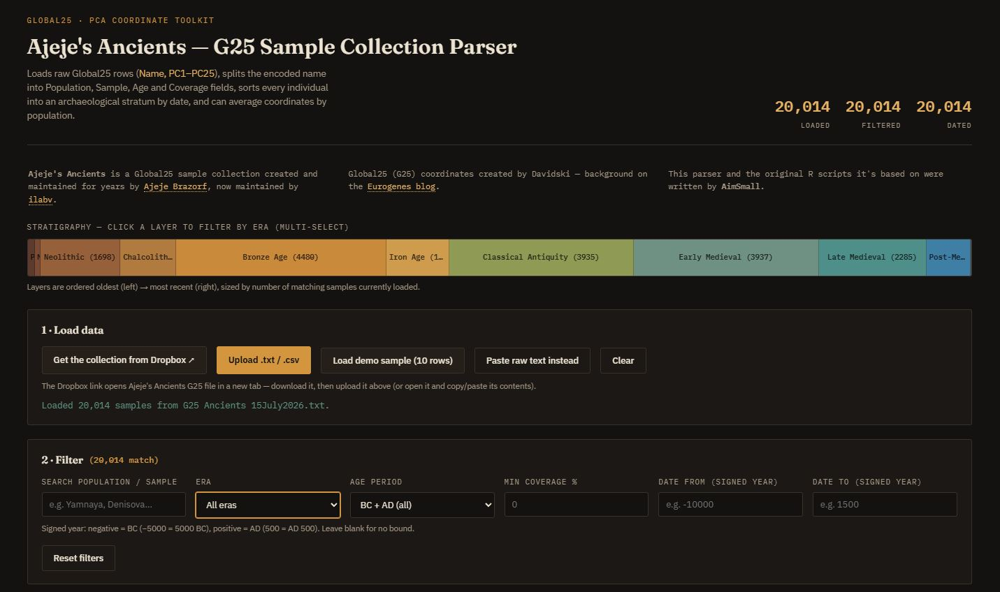
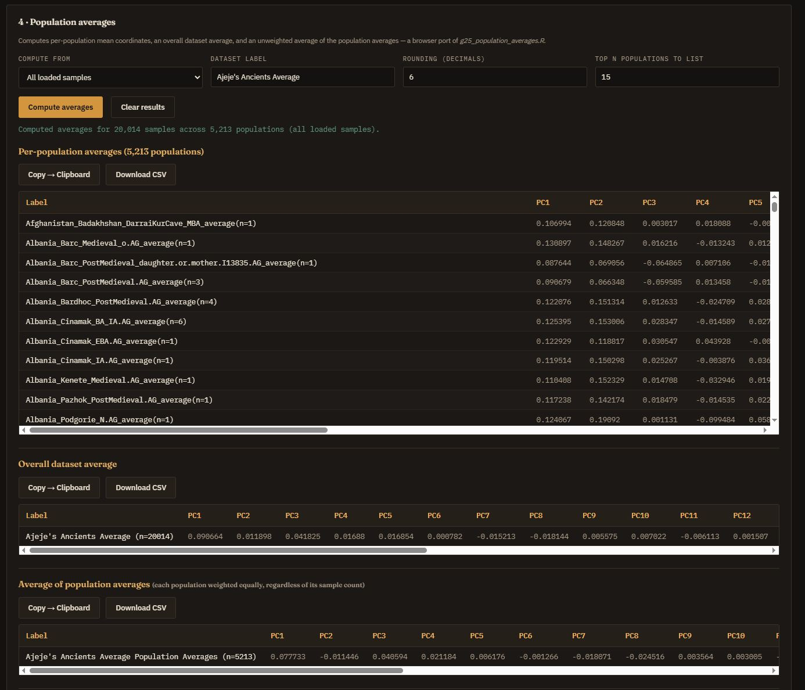
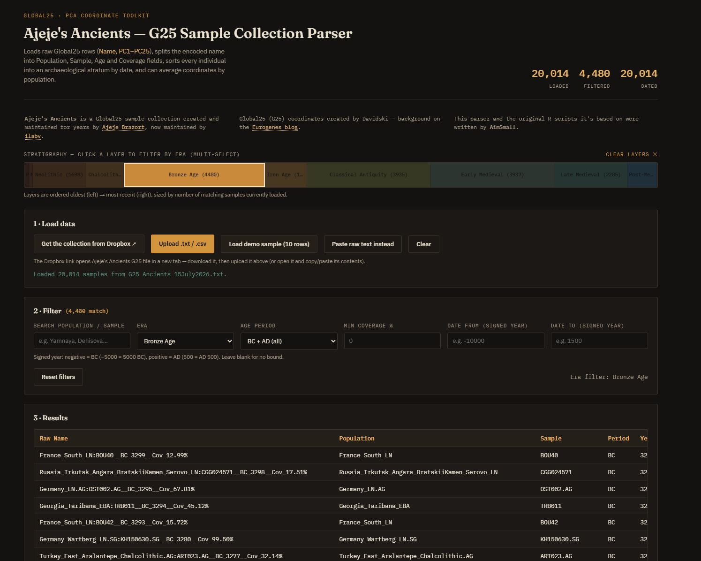

# Ajeje's Ancients — G25 Sample Collection Parser

A single-file, browser-based tool for exploring **Global25 (G25)** ancient DNA PCA coordinates. Drop in a raw G25 text file, and it splits the cryptic sample names into real fields — population, sample ID, age, coverage — sorts everyone into an archaeological era, and lets you filter, sort, and export exactly the slice you're after. It can also generate population-level averages, the same way the companion R script does.

No install, no server, no account. Open the HTML file in a browser and it runs entirely on your machine. Nothing you load is uploaded anywhere.



## What this is actually for

If you've spent any time in the ancient DNA hobbyist space, you've run into Ajeje's G25 coordinate files where every sample looks like this:

```
Turkey_East_Arslantepe_Chalcolithic.AG:ART023.AG__BC_3277__Cov_32.14%,0.0123,-0.0456,...
```

That's a population, a sample ID, a date, and a coverage percentage, all mashed into one field, followed by 25 principal component values. Useful for a script, miserable to read or filter by hand. This tool parses that convention out into proper columns, so you can search by population, restrict a date range, or pull out only Bronze Age samples above 50% coverage, without touching a spreadsheet formula.

It was originally two R scripts — one for parsing, one for generating population averages. This is a browser port of both, built so anyone can use it without installing R or wrangling file paths.

## Features

- **Name parsing** — splits `Population:Sample__Period_Year__Cov_xx.xx%` into `Population`, `Sample`, `AgePeriod`, `AgeYear`, `Coverage`, and `CoveragePct`, matching the original `Ajeje_Parse.R` output field for field.
- **Era stratigraphy** — every dated sample is automatically sorted into one of ten archaeological periods (Paleolithic through Post-Medieval/Modern), plus an "Unknown/Undated" bucket for modern reference samples with no age encoded. Click a layer in the strip to filter to it; click more than one to combine them.
- **Filtering** — by population/sample name, era, BC/AD, minimum coverage, and a signed-year date range (negative for BC, positive for AD).
- **Sortable results table** — every parsed field plus all 25 PCs, click any column header to sort.
- **Export** — copy the filtered results to your clipboard or download them as a CSV, ready to drop into Excel, R, or wherever you're headed next.
- **Population averages** — computes per-population mean coordinates, an overall dataset average, and an unweighted average of the population averages (each population counted once, regardless of how many samples it has). Can run against everything you've loaded, or just your current filtered subset — so you can, say, average only the Iron Age samples from a single region.
- **Data quality check** — flags non-numeric or missing PC values on load, the same check the original R script ran before averaging.



## Getting the data

This tool doesn't ship with any DNA data — you bring your own G25 file. The collection it's built around, **Ajeje's Ancients**, is maintained here:

**[Download G25-Ancients.txt from Dropbox](https://www.dropbox.com/scl/fi/jcg8qw7w8h37acm6z7v0m/G25-Ancients.txt?rlkey=bu28pasrwlsd9ajca14g2dxfk&st=x0qymb2n&e=1&dl=0)**

Download it, then use the **Upload .txt / .csv** button in the tool (or open the file and paste its contents in). The tool also expects the standard G25 format used by most public coordinate sheets — a header-less CSV of `Name,PC1,PC2,...,PC25` — so it should work with other G25 files too, not just this one.

## Filtering by era and date

The stratigraphy strip across the top of the page is both a legend and a filter. Each band is one archaeological period, sized live by how many of your currently loaded samples fall into it. Click a band to filter down to it; click a few to combine them; click "clear layers" to reset.

If you'd rather type an exact range, the date fields below accept a signed year — negative for BC, positive for AD — so `-10000` to `1500` covers everything from the deep Paleolithic through the late Medieval period.



### Era boundaries used

| Era | Range (approximate) |
|---|---|
| Paleolithic | before 10,000 BC |
| Mesolithic | 10,000 – 8,000 BC |
| Neolithic | 8,000 – 4,500 BC |
| Chalcolithic (Copper Age) | 4,500 – 3,300 BC |
| Bronze Age | 3,300 – 1,200 BC |
| Iron Age | 1,200 – 550 BC |
| Classical Antiquity | 550 BC – AD 500 |
| Early Medieval | AD 500 – 1,000 |
| Late Medieval | AD 1,000 – 1,500 |
| Post-Medieval / Modern | AD 1,500 – present |
| Unknown / Undated | no age encoded in the sample name |

These are general-purpose, worldwide approximations — real archaeological periodization varies quite a bit by region, and a Bronze Age in the Aegean doesn't line up neatly with one in Scandinavia. Treat the strip as a useful sorting tool, not an authoritative chronology. The boundaries live in one clearly-marked block near the top of the script if you want to adjust them for your own use.

## Population averages

The averages panel is a browser port of `g25_population_averages.R`. Point it at either everything you've loaded or your current filtered subset, and it produces three outputs:

1. **Per-population averages** — mean PC coordinates for every population, labeled `PopName_average(n=X)`.
2. **Overall dataset average** — the mean across every individual sample.
3. **Average of population averages** — the mean of the per-population means, so a population with 200 samples doesn't drown out one with 2.

Each can be copied to your clipboard or downloaded as its own CSV. If you've got an era filter active when you compute averages, that era gets baked into the downloaded filename automatically, so you don't lose track of which subset a file came from.

## Running it

There's nothing to build or serve. Download `ajeje_ancients_g25_parser.html` and open it in any modern browser — Chrome, Firefox, Safari, Edge. If you want it reachable from a URL instead of a local file, GitHub Pages works fine since it's a single static HTML file.

## Privacy

Everything happens client-side, in your browser's memory. No data is sent to any server, and nothing is stored once you close the tab (there's no local storage or tracking of any kind). If you close the page, you'll need to reload your file next time.

## Credits

- **Ajeje's Ancients**, the G25 sample collection this tool is built around, was created and maintained for years by [Ajeje Brazorf](https://genarchivist.net/member.php?action=profile&uid=282), and is now maintained by [ilabv](https://genarchivist.net/member.php?action=profile&uid=80).
- **Global25 (G25)** coordinates were created by Davidski of the [Eurogenes blog](https://eurogenes.blogspot.com/2025/02/g25-available-again.html), where you can read more about the method itself.
- The original R scripts (`Ajeje_Parse.R` and `g25_population_averages.R`) and this browser port were written by **AimSmall**.

## License

Released under the [GNU General Public License v3.0](LICENSE). Use it, modify it, redistribute it — just keep it under the same license.
